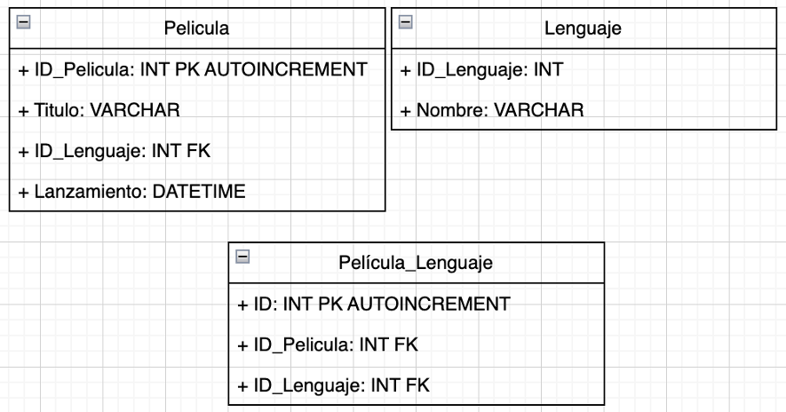

1\. Un grupo de arqueólogos argentinos realizó una investigación
etnoarqueológica con la tribu Nukak, en el territorio del Amazonas
brasilero-colombiano. Allí convivieron con los habitantes de una aldea
de unos cientos de pobladores (cada uno cumple con distintos roles
dentro de la aldea), hallaron viviendas (clasificadas de dos maneras: de
estación seca y de estación lluviosa), alimentos, fauna, flora y
utensilios.

a\) Realizar el DER.

b\) Por cuestiones culturales disminuyó la población. Los pobladores más
jóvenes migraron a otra aldea de manera parcial. Escribir una query que
permita eliminar de la DB representada por el DER anterior los registros
correspondientes a estos pobladores.

c\) Para establecer un promedio de la esperanza de vida en esta aldea,
seleccionar a los pobladores cuya edad sea mayor a 30 años. Escribir una
query para calcular el promedio de edad de las personas adultas de la
población.

d\) La tabla que representa a los pobladores ahora tiene una columna con
el color de ojos de cada persona. Escribir una query que determine cual
es el color de ojos más común en la población

2\. La AFA (Asociación de Futbol Argentino) está renovando su base de
datos y cuenta con las siguientes entidades: Jugadores, directores
técnicos, clubes, artículos, proveedores.

Realizar el DER correspondiente y crear las tablas con los atributos
adecuados.

3\. El dueño de una sucursal de venta de instrumentos musicales quiere
incorporar una base de datos. Los instrumentos son clasificados por
tipo: percusión, viento, electrónicos y cuerda. También cuenta con un
tipo de instrumentos categorizados como "legendarios", los cuales
pertenecieron a alguna celebridad del entorno.

De los instrumentos considerar los atributos:

- Código_Instrumento.

- Nombre. Clasificación.

- Tipo.

- Categoría (es decir, si son comunes o legendarios).

- Artista_Original (en caso de que pertenezca a la categoría de
  "legendario", el nombre de la celebridad a la que perteneció).

- Precio.

De los empleados considerar los siguientes atributos:

- ID_Empleado.

- DNI.

- Nombre.

- Apellido.

- Fecha_De_Nacimiento.

- Domicilio.

- Fecha_De_Alta (es decir, la fecha en la que ingresó a trabajar en
  dicha sucursal).

- Salario.

- Contacto.

De los clientes interesan los siguientes datos:

- ID_Cliente.

- Nombre.

- Apellido.

- Domicilio.

- Teléfono.

- Compras_Acumuladas (es decir, la cantidad de compras totales que
  realizó el cliente).

Crear la respectiva base de datos con sus tablas, cargar al menos 3
registros en cada tabla y mostrar aquellos instrumentos que sean del
tipo legendario.

4\. Manolo estaba administrando la base de datos de su trabajo y estaba
cargando registros en la tabla cliente. Como estaba trabajando a las 6
de la mañana, sin haber consumido una gota de café, mientras cargaba un
cliente se dio cuenta que escribió mal su nombre y su mail.

Nombre: Lhautar0

Mail: lautaro@jimail.co.ar

Ayuda a Manolo a no perder su trabajo y enmendar su error ¿Como harías
para que Manolo corrija los atributos sin borrar el registro?

5\. ¿Qué es una clave foránea o "Foreign Key"? Justifique con sus
palabras.

6\. Dos de las tablas de la base de datos del Club Atlético Huracan son
JUGADOR y TRASPASO (Esta última hace referencia a las ofertas de compra
de los clubes hacia un jugador de Huracan). Si sabemos que la relación
entre estas 2 tablas es 1:N ¿Cuál sería la clave foránea que mantiene la
integridad referencial entre ambas?

7\. La base de datos de una tienda electrónica tiene una tabla CLIENTE.
Se debe mostrar aquellos clientes cuya edad sea par.

8\. Manolo tuvo otro percance (sí, esta al horno), mientras creaba la
tabla PROVEEDOR escribió mal el atributo "nombre" por "nomvre".

a\) ¿Cómo puede corregir ese atributo?

b\) En una realidad alterna Manolo tuvo un error distinto, ahora agrego
el atributo "cumpleaños" a la tabla proveedor ¿Como puede eliminar dicho
atributo sin la necesidad de borrar toda la tabla?

c\) Manolo quiere dejar de cometer errores, para su mala fortuna le
dieron la importante tarea de eliminar de la tabla a las personas que
abandonaron la empresa. Pero, los superiores de Manolo le dijeron que no
los borre permanentemente en caso de que vuelvan ¿Como debe hacerlo?

9\. ¿Esta tabla se encuentra bien definida? De no ser así, indicar los
errores y como corregirlos:

{width="3.125in" height="1.9166666666666667in"}

***[EJERCICIOS ADICIONALES]{.underline}***

**Nota**: Estos ejercicios poseen una dificultad mucho más elevada, ya
que se trabaja con temas muy profundos a cerca de base de datos.

11\. La base de datos de FIUBA posee la tabla ALUMNO, se requiere
mostrar los primeros 20 alumnos cuyos nombres contengan la letra "i" y
que estén ordenados por su padrón de manera ascendente.

12\. De la siguiente base de datos, listar las películas y su idioma.
Ordenarlas por título de manera ascendente:

{width="5.901388888888889in"
height="3.091666666666667in"}

13\. Listar todos los partidos con el nombre de sus árbitros:

{width="5.901388888888889in"
height="1.6791666666666667in"}
