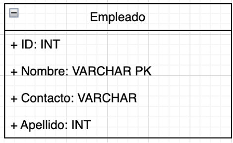

# Base de Datos

## SQL crudo
En estos ejercicios les proponemos pensar en una solución que sólo use SQL directo con la BD:

1. ¿Qué es una clave foránea o "Foreign Key"? Justifique con sus
palabras.

2. Manolo estaba administrando la base de datos de su trabajo y estaba
cargando registros en la tabla cliente. Como estaba trabajando a las 6
de la mañana, sin haber consumido una gota de café, mientras cargaba un
cliente se dio cuenta que escribió mal su nombre y su mail.

Nombre: Lhautar0

Mail: lautaro@jimail.co.ar

  1. Ayuda a Manolo a no perder su trabajo y enmendar su error ¿Cómo harías
  para que corrija los atributos sin borrar el registro?
  2. Manolo tuvo otro percance (sí, esta al horno), mientras creaba la
  tabla PROVEEDOR escribió mal el atributo "nombre" por "nomvre". 
  ¿Cómo puede corregir ese atributo?
  3. En una realidad alterna Manolo tuvo un error distinto, ahora agrego
  el atributo "cumpleaños" a la tabla proveedor ¿Cómo puede eliminar dicho
  atributo sin la necesidad de borrar toda la tabla?

3. Un grupo de arqueólogos argentinos realizó una investigación
etnoarqueológica con la tribu Nukak, en el territorio del Amazonas
brasilero-colombiano. Allí convivieron con una aldea de 24 pobladores
(cada uno cumple con distintos roles dentro de la aldea), hallaron
viviendas (clasificadas de dos maneras: de estación seca y de estación
lluviosa), alimentos, fauna, flora y utensilios.

  1. Realizar el Diagrama de Entidad-Relación (DER).

  2. Por cuestiones culturales disminuyó la población. Los pobladores más
  jóvenes migraron a otra aldea de manera parcial. Eliminarlos de la base
  de datos.

  3. Para establecer un promedio de la esperanza de vida en esta aldea,
  seleccionar a los pobladores que sean mayores. Ordenarlos
  por edad de manera ascendente.

  4. La tabla que representa a los pobladores ahora tiene una columna con
  el color de ojos de cada persona. Escribir una query que determine cual
  es el color de ojos más común en la población.

  5. Devolver los pobladores cuya edad sea par.

4. La AFA (Asociación de Futbol Argentino) está renovando su base de
datos y cuenta con las siguientes entidades: jugadores, directores
técnicos, clubes, artículos, proveedores.

Realizar el DER correspondiente y crear las tablas con los atributos
adecuados. En este debe quedar en claro cuáles son Primary Keys y cuáles Foreign Keys.

5. El dueño de una sucursal de venta de instrumentos musicales quiere
incorporar una base de datos. Los instrumentos son clasificados por
tipo: percusión, viento, electrónicos y cuerda. También cuenta con un
tipo de instrumentos categorizados como "legendarios", los cuales
pertenecieron a alguna celebridad del entorno.

De los instrumentos considerar los atributos:

  - Código_Instrumento.
  - Nombre. 
  - Clasificación.
  - Tipo.
  - Categoría (es decir, si son comunes o legendarios).
  - Artista_Original (en caso de que pertenezca a la categoría de
  "legendario", el nombre de la celebridad a la que perteneció).
  - Precio.

De los empleados considerar los siguientes atributos:

  - ID_Empleado.
  - DNI.
  - Nombre.
  - Apellido.
  - Fecha_De_Nacimiento.
  - Domicilio.
  - Fecha_De_Alta (es decir, la fecha en la que ingresó a trabajar en
  dicha sucursal).
  - Salario.
  - Contacto.

De los clientes interesan los siguientes datos:

  - ID_Cliente.
  - Nombre.
  - Apellido.
  - Domicilio.
  - Teléfono.
  - Compras_Acumuladas (es decir, la cantidad de compras totales que
  realizó el cliente).

  1. Crear la respectiva base de datos con sus tablas.
  2. Marcar en cada tabla las primary keys y las foreign keys.
  3. Cargar al menos 3 registros en cada tabla.
  4. Mostrar aquellos instrumentos que sean del tipo legendario.

6. Dos de las tablas de la base de datos del Club Atlético Huracan son
JUGADOR y TRASPASO (Esta última hace referencia a las ofertas de compra
de los clubes hacia un jugador de Huracan). Si sabemos que la relación
entre estas 2 tablas es 1:N ¿Cuál sería la clave foránea que mantiene la
integridad referencial entre ambas?

7. ¿Esta tabla se encuentra bien definida? De no ser así, indicar los
errores y como corregirlos:

{width="3.125in" height="1.9166666666666667in"}

## Queries
Estos ejercicios hacen hincapié en consultas más avanzadas a la BD. Les proponemos resolverlo usando el ORM que usamos en clase, y a los valientes resolverlo además con SQL crudo.

1. La base de datos de FIUBA posee la tabla ALUMNO, se requiere
mostrar los primeros 20 alumnos cuyos nombres contengan la letra "i" y
que estén ordenados por su padrón de manera ascendente.

2. Manolo quiere dejar de cometer errores, para su mala fortuna le
dieron la importante tarea de eliminar de la tabla a las personas que
abandonaron la empresa. Pero, los superiores de Manolo le dijeron que no
los borre permanentemente en caso de que vuelvan ¿Cómo debe hacerlo?

3. De la siguiente base de datos, listar las películas y su idioma.
Ordenarlas por título de manera ascendente:

{width="5.901388888888889in"
height="3.091666666666667in"}

4. Listar todos los partidos con el nombre de sus árbitros, partiendo de la siguiente base de datos.

{width="5.901388888888889in"
height="1.6791666666666667in"}
